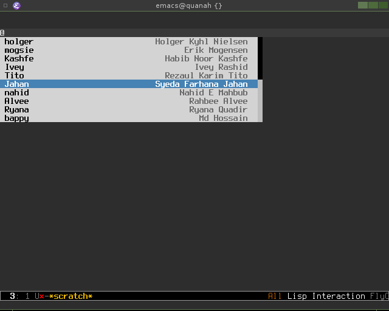

auto-complete backend for entering HipChat nicks (aka mention names).

## Background

We use HipChat at work and I use Emacs/ERC as my chat client. Since
HipChat doesn't expose the mention names as XMPP nicks (which would
have been SO nice), I looked around for a plugin which allowed me to
lookup the nicks/mention names of the people in the room. Since I
didn't find any such plugin, I wrote one.

## Usage

First off, you'll need to create a HipChat API auth token, you can
create one after you login to your profile in your web browser. At the
time of writing, the URL to creating auth tokens is:
https://hipchat.com/account/api

With that set, add this to your `.emacs`:
```
(setq ac-hipchat-nick-auth-token "foobar")
(ac-hipchat-nick-set-current-room "all")
```

Then, in the buffer where you want HipChat nick completion, you must
first have enabled `auto-completion-mode` (if you haven't already done
so) and then run `ac-hipchat-nick-setup`.

To change room, i.e. the room from which you want completion of the
nick/mention name, run:

```
M-x ac-hipchat-nick-set-current-room RET my-room RET
```

You're now set, any time you write `@`, you'll get a drop down list of
all the users in the current room.



## Copying

Please do, the code is released under GPLv3, see [LICENSE](LICENSE)
for further details.

## Enjoy

There are probably a league of improvements that can be done to my
newbie elisp code, suggestions are most welcome.

Cheers,

-Torstein
